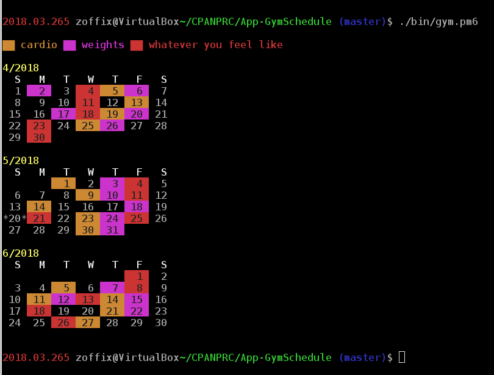

[](https://travis-ci.org/zoffixznet/perl6-App-GymScheduler)

# NAME

`App::GymScheduler` — Randomized schedule maker for your workouts


```perl6
    $ gym.p6
```

# DESCRIPTION

This program creates a random schedule for your workouts. It lets you have N
workout days each month, but it randomizes when the workout days occur,
so you don't feel like you're in a rut.



The program ensures the workouts don't happen on the weekend and
supports workout "modes" that it loops through one after another. These rules
are currently hard-coded, but if there's interest to make these customizeable
I can take a PR.

# EXECUTABLES

This distribution installs `gym.p6` program. On its first execution will create
`.gym.p6.conf` file in your home directory. Edit that file to customize
your scheduler, if necessary. Running the program prints a calendar with
your work out days marked off.

# LIMITATIONS

Requires
[`Terminal::ANSIColor`](https://modules.perl6.org/repo/Terminal::ANSIColor),
which probably doesn't work on Windows's `cmd.exe`.

#### REPOSITORY

Fork this module on GitHub:
https://github.com/zoffixznet/perl6-App-GymScheduler

#### BUGS

To report bugs or request features, please use
https://github.com/zoffixznet/perl6-App-GymScheduler/issues

#### AUTHOR

Zoffix Znet (http://perl6.party/)

#### LICENSE

You can use and distribute this module under the terms of the
The Artistic License 2.0. See the `LICENSE` file included in this
distribution for complete details.

The `META6.json` file of this distribution may be distributed and modified
without restrictions or attribution.
